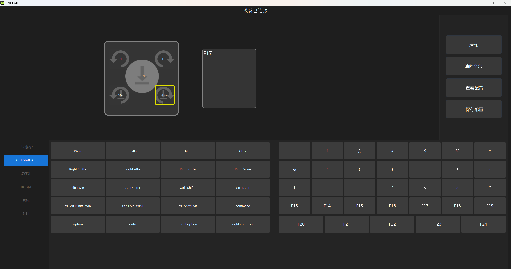

# Smart Knob AHK（智能旋钮多场景快捷键）

一个适用于 Windows 的 AutoHotkey v2 脚本：同一个旋钮会根据当前正在使用的软件或网页，自动执行不同功能。

当前稳定版本：**v1.1.1**

## 主要功能

脚本支持旋钮的五种操作：

| 旋钮操作 | 外设发送键 |
| --- | --- |
| 按下 | F13 |
| 向左旋转 | F14 |
| 向右旋转 | F15 |
| 按下并向左旋转 | F16 |
| 按下并向右旋转 | F17 |

F13–F17 不需要 Ctrl、Alt、Shift，也不受 Num Lock 影响，可以减少外设连续触发时出现修饰键“卡住”的概率。

## 场景功能表

| 当前场景 | 按下 F13 | 左转 F14 | 右转 F15 | 按住左转 F16 | 按住右转 F17 |
| --- | --- | --- | --- | --- | --- |
| 常规状态 | Ctrl+Alt+↓ | 音量减小 | 音量增加 | Win+V（剪贴板历史） | Win+D（显示/恢复桌面） |
| Edge 哔哩哔哩 | 空格 | ← | → | Shift+1 | Shift+2 |
| Edge PDF | Ctrl+↓ | 滚轮向上 | 滚轮向下 | Ctrl+滚轮向下 | Ctrl+滚轮向上 |
| 抖音客户端 | 空格 | ← | → | ↑ | ↓ |

识别优先级：抖音客户端 → Edge PDF → Edge 哔哩哔哩 → 常规模式。

## ANTICATER 按钮软件配置

在按钮软件里，把五种操作依次配置为 F13、F14、F15、F16、F17：

对应关系：

1. 中间按下：F13
2. 向左旋转：F14
3. 向右旋转：F15
4. 按下并向左旋转：F16
5. 按下并向右旋转：F17

## 安装和使用

1. 安装 [AutoHotkey v2](https://www.autohotkey.com/)。
2. 下载 [`src/smart-knob.ahk`](src/smart-knob.ahk)。
3. 按照上图设置按钮软件，并保存配置。
4. 双击运行 `smart-knob.ahk`。
5. 任务栏通知区域出现绿色 H 图标后，脚本即已生效。

更新脚本前，请先右键旧脚本的绿色 H 图标并选择 **Exit（退出）**，避免多个版本同时运行。

## 当前识别条件

- 抖音客户端：活动进程为 `douyin.exe`。
- Edge PDF：活动进程为 `msedge.exe`，窗口标题包含 `.pdf`。
- Edge 哔哩哔哩：活动进程为 `msedge.exe`，窗口标题包含“哔哩哔哩”或 `bilibili`。
- 其他窗口：使用常规模式。

目前只针对 Microsoft Edge 设置了 PDF 和哔哩哔哩识别规则；Chrome、其他浏览器或独立 PDF 阅读器需要自行增加条件。

## 常见问题

### 为什么不用 Ctrl+数字或 Ctrl+Alt+数字作为外设触发键？

早期版本使用过这些组合键。旋钮连续触发时，个别设备或系统环境可能遗漏 Ctrl/Alt 的释放事件，造成滚轮缩放、桌面图标变化或修饰键持续按下。v1.0.0 起改为独立的 F13–F17，问题在实际测试中消失。

### 为什么双击脚本后没有窗口？

AutoHotkey 脚本通常在后台运行。请查看任务栏通知区域是否有绿色 H 图标。

### 为什么没有进入哔哩哔哩或 PDF 模式？

脚本只检查当前最前面的窗口及 Edge 当前标签页。请确认目标标签页位于 Microsoft Edge，并且标题含有相应关键词。

## 版本记录

参见 [CHANGELOG.md](CHANGELOG.md)。

## 许可证

本项目采用 [MIT License](LICENSE)，允许自由使用、修改和分享。

